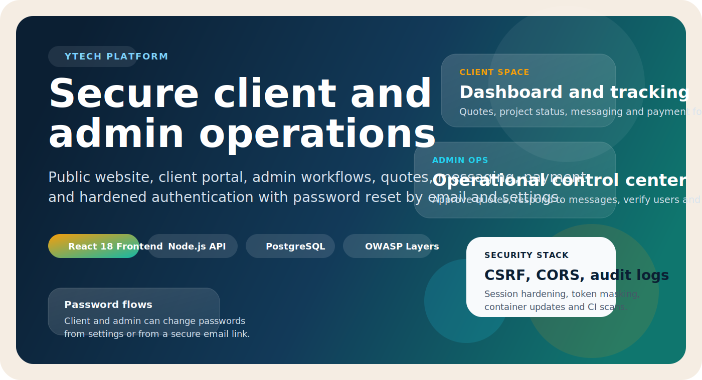
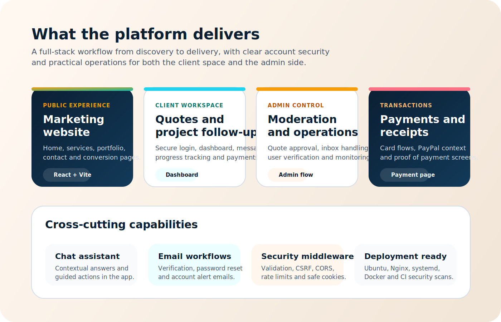
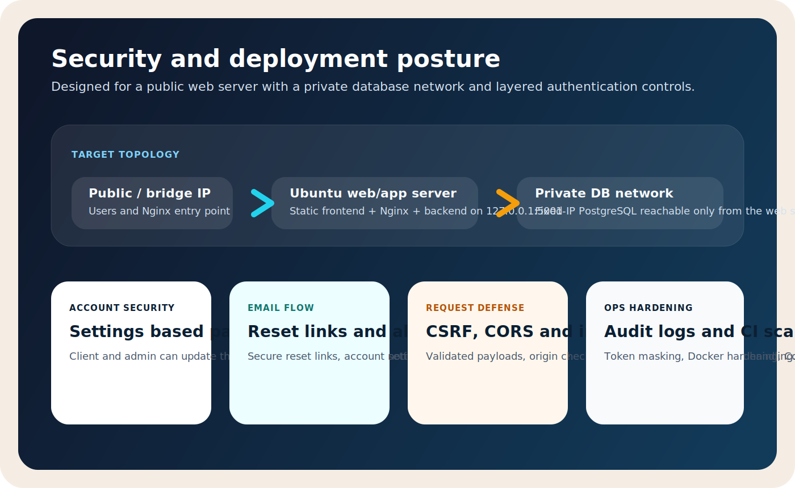

# YTECH Web Application

<p align="center">
  
</p>

<p align="center">
  Full-stack platform for YTECH with a public website, secure client area, admin operations, quotes, messaging, payment workflows and hardened authentication.
</p>

<p align="center">
  
  
  
  
</p>

<p align="center">
  
  
  
</p>

## Overview

YTECH is designed as an operational web platform, not just a showcase site. It combines:

- a public-facing marketing surface
- a secure client dashboard
- an admin workspace for operational follow-up
- quote validation and payment flows
- messaging and project tracking
- account security with password change from settings and secure email reset links

## Product Surface

<p align="center">
  
</p>

### Core capabilities

| Area | What it covers |
| --- | --- |
| Public site | Home, services, portfolio, contact and conversion-oriented pages |
| Client area | Authentication, quotes, project follow-up, messaging and payment status |
| Admin area | Quote review, message handling, user supervision and operational control |
| Payment | Card and PayPal style flows, receipts and transaction context |
| Communication | Contact requests, internal messaging and email notifications |
| Assistant | In-app chatbot routes and guided actions |

## Security Posture

<p align="center">
  
</p>

### Recent hardening

- client and admin can change their password from a dedicated settings page
- client and admin can request a secure password reset by email
- password reuse is blocked during change and reset flows
- other sessions are invalidated after password updates
- sensitive tokens are masked in logs and security audit trails
- CSRF, CORS, validation and rate limiting are enforced in the backend
- Docker and CI security workflows were tightened with CodeQL, Semgrep and Trivy

## Production-First Deployment Model

This repository is now aligned for the following target architecture:

- one Ubuntu web/app server
- one separate PostgreSQL server with a fixed IP
- two interfaces or IPs on the web server
- one public or bridge IP for users and Nginx
- one private IP reserved for traffic between the web server and PostgreSQL
- frontend served statically by Nginx
- backend kept local behind Nginx on `127.0.0.1:5001`

### Topology example

```text
Public / bridge IP web server: 192.168.1.16
Private IP web server:         10.10.10.2
Fixed IP PostgreSQL server:    10.10.10.3
```

### Production rules

- `FRONTEND_URL` and `PUBLIC_API_URL` should use the public IP or the public domain
- `DB_HOST` or `DATABASE_URL` should point to the fixed private IP of the PostgreSQL server
- database traffic should leave through the private interface of the web server
- the database should only accept connections from the private IP of the web/app server

## Quick Start

### Backend

```bash
cd backend
npm install
npm run dev
```

### Frontend

```bash
cd frontend
npm install
npm run dev
```

If port `3000` is already used:

```bash
cd frontend
npm run dev -- --port 3001
```

### Docker

This repository now includes a local Docker Compose stack for the app and PostgreSQL.

Requirements:

- Docker Desktop or Docker Engine with Compose enabled
- port `5001` available on the host

Run steps:

1. Copy the Docker environment file.

PowerShell:

```powershell
Copy-Item .env.docker.example .env
```

Bash:

```bash
cp .env.docker.example .env
```

2. Optionally edit `.env` if you want to change the local port, public host, admin seed account or secrets.

Important variables for the web app endpoint:

- `APP_PORT`: host port published by Docker
- `APP_PUBLIC_HOST`: hostname or IP used by the browser
- `FRONTEND_URL`: public web app URL
- `PUBLIC_API_URL`: public API URL

Example if you want the app on `http://192.168.1.20:8080`:

```env
APP_PORT=8080
APP_PUBLIC_HOST=192.168.1.20
FRONTEND_URL=http://192.168.1.20:8080
PUBLIC_API_URL=http://192.168.1.20:8080/api
ALLOWED_ORIGINS=http://192.168.1.20:8080,http://localhost:8080,http://127.0.0.1:8080
PASSWORD_RESET_BASE_URL=http://192.168.1.20:8080
EMAIL_VERIFICATION_BASE_URL=http://192.168.1.20:8080
```

3. Start the stack.

```bash
docker compose up --build
```

4. Open the application:

- `http://localhost:5001`

5. To run in detached mode:

```bash
docker compose up --build -d
```

6. To view logs:

```bash
docker compose logs -f
```

7. To stop the stack:

```bash
docker compose down
```

8. To stop the stack and delete the PostgreSQL volume:

```bash
docker compose down -v
```

The Docker setup uses:

- one `app` container built from the root [`Dockerfile`](./Dockerfile)
- one `db` container based on PostgreSQL 16
- automatic database bootstrapping through the existing backend startup flow
- a real container healthcheck for the application and the database

If you need different local ports, admin credentials or secrets, edit the copied `.env` file before running Compose.

## Production Environment Essentials

### Backend

| Variable | Purpose |
| --- | --- |
| `NODE_ENV` | Switches runtime behavior between development and production |
| `HOST` | Bind host for the backend, typically `127.0.0.1` in production |
| `PORT` | Backend listening port |
| `FRONTEND_URL` | Public frontend URL used by auth and emails |
| `PUBLIC_API_URL` | Public API base URL |
| `ALLOWED_ORIGINS` | CORS allowlist |
| `DB_HOST` | Fixed IP or hostname of the remote PostgreSQL server |
| `DB_PORT` | PostgreSQL port |
| `DB_NAME` | Database name |
| `DB_USER` | Database user |
| `DB_PASSWORD` | Database password |
| `DATABASE_URL` | Full connection string alternative |
| `DB_SSL` | Enables SSL to the database when required |
| `JWT_SECRET` | JWT signing secret |
| `SESSION_SECRET` | Session protection secret |

### Frontend

| Variable | Purpose |
| --- | --- |
| `REACT_APP_ENV` | Frontend environment |
| `REACT_APP_API_URL` | Optional explicit API URL |
| `REACT_APP_WS_URL` | Optional explicit websocket URL |

Examples are provided in:

- [`backend/.env.production.example`](./backend/.env.production.example)
- [`frontend/.env.production.example`](./frontend/.env.production.example)

## Verification Snapshot

Latest local verification completed on this branch before the last push:

- backend security tests: `25/25 OK`
- frontend tests: `10/10 OK`
- frontend build: `OK`

## Project Documentation

- [`DEPLOYMENT.md`](./DEPLOYMENT.md): Ubuntu + Nginx + remote PostgreSQL deployment guide
- [`DEPLOYMENT-UPDATE.md`](./DEPLOYMENT-UPDATE.md): short production recap
- [`PERSISTENCE-DEPLOYMENT.md`](./PERSISTENCE-DEPLOYMENT.md): persistence, backup and restore notes
- [`docs/SECURITY.md`](./docs/SECURITY.md): security documentation

## Deployment Script

The provided [`deploy.sh`](./deploy.sh) is aligned with this model:

- backend managed by `systemd`
- static frontend served by Nginx
- backend kept local behind Nginx
- production setup centered on Ubuntu

For a full production rollout, use [`DEPLOYMENT.md`](./DEPLOYMENT.md).
