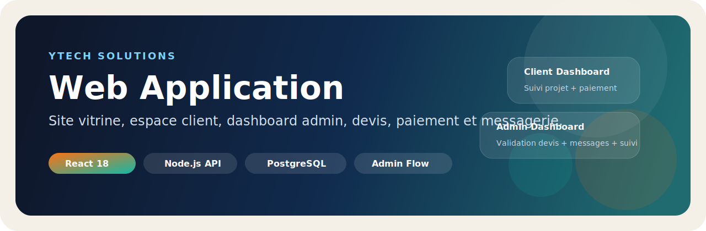
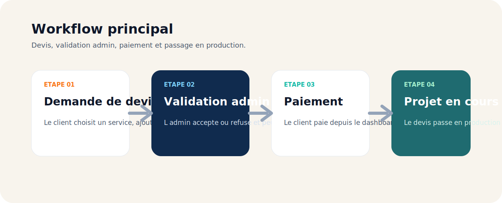
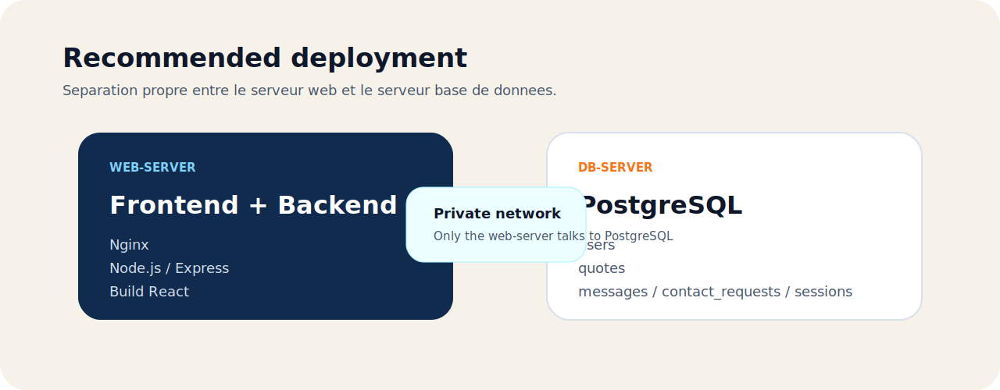

# 🚀 YTECH Web Application

<p align="center">
  
</p>

<p align="center">
  
  
  
  
</p>

<p align="center">
  Site vitrine, espace client, espace admin, devis, paiement, messagerie et suivi projet dans une seule application.
</p>

Les visuels utilises dans ce README sont versionnes dans `docs/`.

---

## ✨ Overview

YTECH Web Application est une plateforme full stack qui permet de :

- 🌐 presenter les services, le portfolio et l identite YTECH
- 🧾 recevoir des demandes de devis avec estimation logique
- 👤 gerer les comptes client et admin
- 📊 suivre les projets depuis un dashboard
- 💳 payer un devis valide
- 💬 centraliser les conversations client / admin
- 🗄️ persister les donnees metier dans PostgreSQL

## 🖼️ Parcours Principal

<p align="center">
  
</p>

Le flow principal est le suivant :

1. le client envoie un devis
2. l admin analyse la demande
3. l admin accepte ou refuse
4. si le devis est accepte, le paiement devient disponible
5. le paiement valide fait passer le projet en cours

## 🎯 Fonctionnalites

### 🌍 Site public
- accueil redesign
- services
- portfolio
- a propos
- contact avec 2 intents :
  - besoin d aide
  - aide devis
- devis avec estimation selon service + options + delai
- chatbot integre
- mode clair / sombre

### 👨‍💼 Espace client
- inscription et connexion
- dashboard client
- suivi d avancement du projet
- consultation des devis
- paiement d un devis accepte
- messagerie avec l equipe

### 🛡️ Espace admin
- dashboard admin centre sur les devis
- suivi des nouveaux devis
- suivi des paiements en attente
- acceptation / refus avec note admin
- fixation du montant a payer
- messagerie admin
- lecture des demandes de contact, devis et messages

## 🧱 Stack Technique

| Layer | Tech |
|---|---|
| Frontend | React 18, React Router DOM 6, CSS |
| Backend | Node.js, Express |
| Database | PostgreSQL |
| Security | Helmet, CORS, JWT, rate limiting, bcryptjs |
| Runtime | npm, PM2 ou Node |
| Deploy | web-server + db-server |

## 🏗️ Deploiement Recommande

<p align="center">
  
</p>

Architecture conseillee :

- `web-server` : Nginx + Node.js + backend + build frontend
- `db-server` : PostgreSQL uniquement

Principe :

- le frontend build est servi par le backend ou via Nginx
- le backend tourne sur le `web-server`
- PostgreSQL tourne sur le `db-server`
- le `web-server` se connecte a PostgreSQL via IP privee
- le port `5432` ne doit pas etre public

## 📁 Structure

```text
YTech-Web-Application/
|-- frontend/
|   |-- public/
|   `-- src/
|       |-- components/
|       |-- pages/
|       |-- styles/
|       |-- utils/
|       `-- App.jsx
|-- backend/
|   |-- config/
|   |-- middleware/
|   |-- models/
|   |-- routes/
|   |-- utils/
|   `-- server.js
|-- docs/
|   |-- banner.svg
|   |-- workflow.svg
|   `-- deployment.svg
`-- README.md
```

## 🔗 Routes Principales

### Frontend
- `/`
- `/services`
- `/portfolio`
- `/about`
- `/contact`
- `/devis`
- `/login`
- `/register`
- `/payment`
- `/payment-success`
- `/dashboard`
- `/messages`
- `/devis-management`
- `/admin-messages`

### API backend
- `/api/health`
- `/api/auth`
- `/api/user`
- `/api/contact`
- `/api/quotes`
- `/api/messages`

## 🗄️ Base de Donnees

PostgreSQL est utilise pour :

- les utilisateurs
- les sessions
- les demandes de contact
- les devis
- les messages

Le bootstrap backend cree automatiquement les tables si elles n existent pas encore.

Le compte admin est synchronise au demarrage via les variables d environnement.

## ⚡ Quick Start

### 1. Cloner le projet

```bash
git clone https://github.com/ytech-solutions-projet/YTech-Web-Application.git
cd YTech-Web-Application
```

### 2. Installer les dependances

```bash
cd frontend
npm install

cd ../backend
npm install
```

### 3. Configurer `backend/.env`

```env
NODE_ENV=development
PORT=5001

FRONTEND_URL=http://localhost:3000
ALLOWED_ORIGINS=http://localhost:3000
TRUST_PROXY=false

JWT_SECRET=change-this-with-a-strong-secret-at-least-32-characters
SESSION_SECRET=change-this-with-a-strong-secret-at-least-32-characters

AUTH_COOKIE_NAME=ytech_auth
AUTH_COOKIE_SECURE=false
AUTH_COOKIE_SAME_SITE=strict
SESSION_TIMEOUT_HOURS=24

RATE_LIMIT_WINDOW_MS=900000
RATE_LIMIT_MAX_REQUESTS=100
AUTH_RATE_LIMIT_MAX=5
REGISTER_RATE_LIMIT_MAX=5
PASSWORD_RESET_RATE_LIMIT_MAX=5
CONTACT_RATE_LIMIT_MAX=10
QUOTE_RATE_LIMIT_MAX=10

DB_HOST=localhost
DB_PORT=5432
DB_NAME=ytech_db
DB_USER=ytech_user
DB_PASSWORD=your_postgresql_password

ADMIN_SEED_NAME=YTECH Admin
ADMIN_SEED_EMAIL=admin@ytech.ma
ADMIN_SEED_PASSWORD=change-this-admin-password
ADMIN_SEED_PHONE=+212600000000
ADMIN_SEED_COMPANY=YTECH
```

### 4. Lancer le projet

Backend :

```bash
cd backend
npm start
```

Frontend :

```bash
cd frontend
npm start
```

### 5. Acces local

- Frontend : `http://localhost:3000`
- Backend : `http://localhost:5001`
- Health check : `http://localhost:5001/api/health`

## 🏭 Build Production

Frontend :

```bash
cd frontend
npm run build
```

Backend :

```bash
cd backend
npm start
```

En production, le backend peut servir le build React directement.

## 🔐 Securite Deja En Place

Le projet inclut deja :

- validation et normalisation des donnees
- mots de passe forts
- hash des mots de passe avec `bcryptjs`
- JWT en cookie HTTP-only
- verification serveur de session
- `helmet`
- politique CORS
- rate limiting
- protection de routes par role
- seed admin via variables d environnement
- stockage metier cote serveur / PostgreSQL

## 🧪 Commandes Utiles

Frontend :

```bash
npm start
npm run build
```

Backend :

```bash
npm start
npm run dev
```

## 📌 Notes Importantes

- ne mets pas le mot de passe admin en dur dans un README public
- les identifiants admin se definissent via `backend/.env`
- le backend doit etre redemarre apres modification du `.env`
- en dev, le frontend proxyfie vers `http://localhost:5001`

## ✅ Etat Actuel

Le projet inclut deja :

- redesign global des pages
- dark mode / light mode
- chatbot
- gestion admin / client
- PostgreSQL pour les donnees principales
- flow devis -> validation admin -> paiement -> projet en cours
- compatibilite avec architecture `web-server` + `db-server`

## 🔗 Repository

GitHub :

`https://github.com/ytech-solutions-projet/YTech-Web-Application.git`

---

> 💡 Astuce : si tu veux un README encore plus impressionnant, tu peux remplacer les SVG dans `docs/` par de vraies captures d ecran de l accueil, du dashboard et du paiement.
